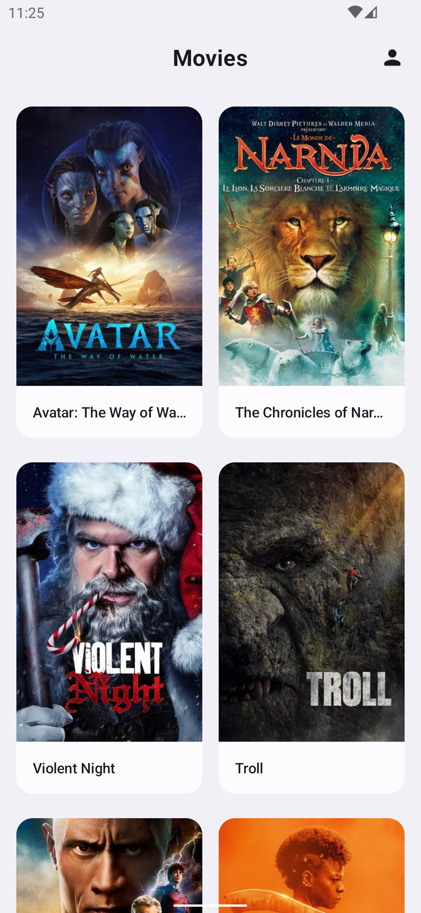

Movies App
==================

To run the app use the `prod` flavor. It makes real network calls to a The movie db api.

The `demo` flavor uses static local data to allow immediate building and exploring of the UI.

# Features

**Movies** allows users to discover new movie releases from
[TMDB Api](https://api.themoviedb.org/4/). 
Users can see the full movie description and details tapping on .

## Screenshots

